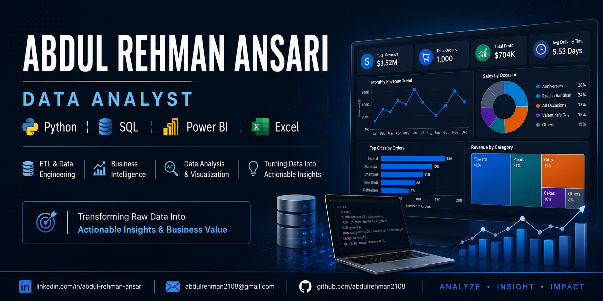

  

<h1 align="center">Abdul Rehman Ansari</h1>

<h3 align="center">Data Analyst | Business Intelligence | Power BI | SQL | Python</h3>

Transforming raw data into actionable business insights through analytics, visualization, and business intelligence.

---

## About Me

Data Analyst with hands-on experience in transforming raw business data into meaningful insights using Python, SQL, Power BI, and Excel.

I have built end-to-end analytics projects covering data cleaning, ETL processes, exploratory data analysis, KPI development, dashboard creation, and business reporting across financial, sales, and customer domains.

Currently focused on strengthening expertise in:

- Data Analytics
- Business Intelligence
- Financial Analytics
- Analytics Engineering
- Data Warehousing

---

## Technical Skills

| Category | Skills |
|-----------|-----------|
| Programming | Python, SQL |
| Business Intelligence | Power BI, Excel |
| Libraries | Pandas, NumPy |
| Databases | MySQL |
| Tools | Jupyter Notebook, Git, GitHub |
| Analytics | EDA, KPI Development, Dashboarding |
| Data Processing | ETL, Data Cleaning, Data Transformation |
| Concepts | Data Modeling, Business Analytics, Data Visualization |

---

## Tech Stack

### Languages & Databases

### Analytics & BI

### Data Processing

### Development Tools

---

## Featured Projects

### 📊 Mutual Fund Analytics Platform

End-to-end financial analytics platform leveraging Python, SQL, and Power BI to evaluate fund performance, risk metrics, category trends, and investment opportunities through interactive dashboards and analytical reporting.

### 📈 Sales Performance Analytics

Business intelligence solution focused on revenue analysis, product performance, regional sales trends, and growth opportunities through data-driven insights and dashboard visualization.

### 👥 Customer Behaviour Analytics

Customer analytics project involving data cleaning, ETL processing, SQL analysis, and dashboard development to uncover purchasing behavior, customer segmentation, and engagement patterns.

### 🎁 Ferns & Petals Business Analytics

Business analytics dashboard designed to analyze customer purchasing behavior, occasion-based sales trends, product performance, and regional demand patterns for strategic decision-making.

---

## Certifications

🏆 Data Analyst – Big 4 Ready

🔗 Certificate:
https://www.oneroadmap.io/skills/data-analyst-big4/certificate/CERT-003A0D99

---

## Core Competencies

- Data Analysis
- Business Intelligence
- Dashboard Development
- Data Cleaning
- ETL Pipelines
- KPI Design
- Data Visualization
- SQL Analytics
- Financial Analytics
- Customer Analytics
- Sales Analytics
- Business Reporting

---

## Currently Working On

🚀 Data Warehouse & ETL Analytics Platform

🚀 Advanced SQL Analytics Portfolio

🚀 Business Intelligence Reporting Solutions

---

## GitHub Statistics

  

  

---

## Career Objective

Seeking opportunities as a Data Analyst, Business Intelligence Analyst, or Business Analyst where analytical thinking, data storytelling, and business intelligence can be leveraged to solve real-world business problems and drive informed decision-making.

---

## Connect With Me

💼 LinkedIn: linkedin.com/in/abdul-rehman-ansari-22630928b

📧 Email: abdulrehmann2108@gmail.com

💻 GitHub: https://github.com/abdulrehman2108

---

<b>Turning Data Into Insights • Insights Into Decisions • Decisions Into Impact</b>

